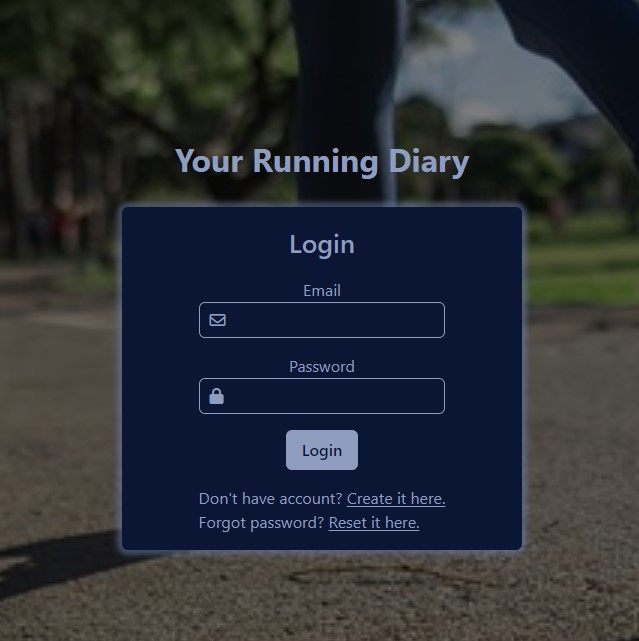
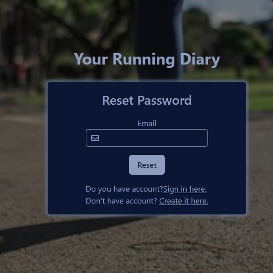

# running-log(in progress)

## Description

Running Diary is application which will allows you to store your running logs, such as kilometers, time, pace, burned calories. Also there will be some statistics like how many training you had, total time, total burned calories and some graphs like run kilometers each month. There is also user "dashboard" which allow you to change your basic information(name, surname or your weight), upload your profile picture, change password or remove your account.

Stack in this project:
<br />


<br />


## Some images from project so far

<p align="center">
  
  
  
  
  
</p>

## Recommended IDE Setup

[VSCode](https://code.visualstudio.com/) + [Volar](https://marketplace.visualstudio.com/items?itemName=Vue.volar) (and disable Vetur) + [TypeScript Vue Plugin (Volar)](https://marketplace.visualstudio.com/items?itemName=Vue.vscode-typescript-vue-plugin).

## Customize configuration

See [Vite Configuration Reference](https://vitejs.dev/config/).

## Project Setup

```sh
npm install
```

### Compile and Hot-Reload for Development

```sh
npm run dev
```

### Compile and Minify for Production

```sh
npm run build
```
