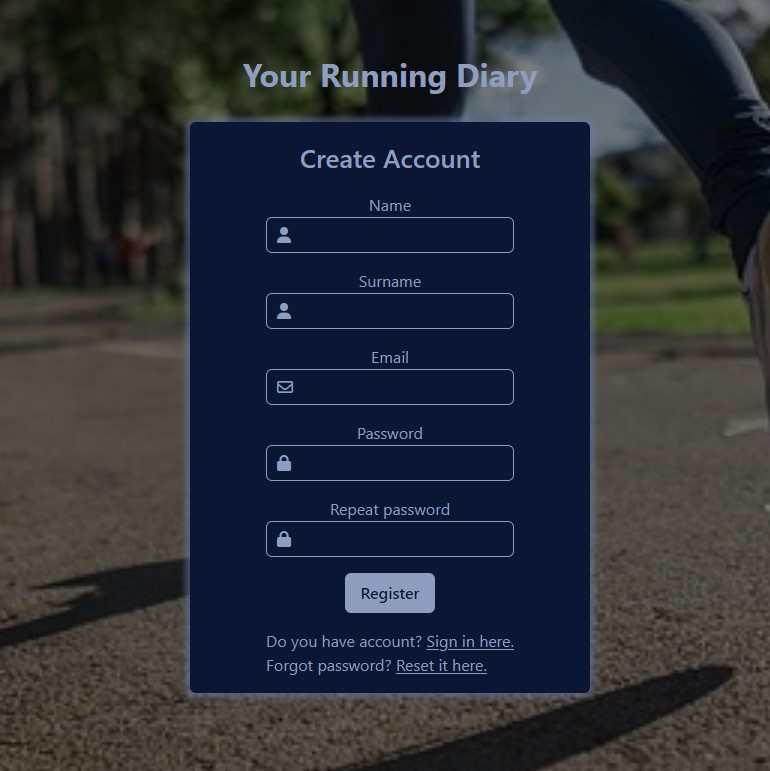
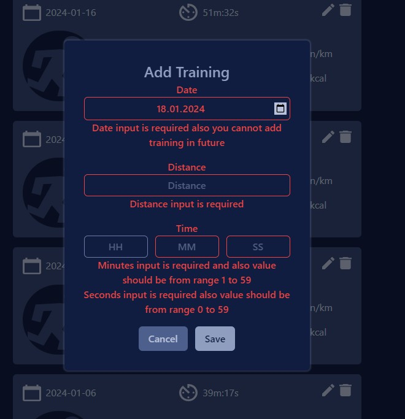

# Running Diary

## Description

Running Diary is application which will allows you to store your running logs, you need to provide date, time, and covered distance. Details like burned calories, avarage pace and average speed will be calculate automatically. Goals view is feature which allow you to create some training goals, like "Finish 5km run under 30 minutes", "Lose weight" etc. At statistic view you can check your statistics like fastest 5km, 10km runs, number of trainings etc. Also in statistics view is chart which show how many kilometers you traveled per month.

Live: https://running-diary-38ae0.web.app/

For testing you can use test account:
<br>
-login: test@test.com
<br>
-password: test123
<br>
Or create your own account.

Stack in this project:
<br />


<br />

## Some images from project

### Login View

<p align="center">
  
  
  
</p>

### Main View

<p align="center">
  
  
  
</p>

### Profile management

<p align="center">
  
  
</p>

### Statistics view

<p align="center">
  
</p>

### Goals View

<p align="center">
  
  
  
  
</p>

## Recommended IDE Setup

[VSCode](https://code.visualstudio.com/) + [Volar](https://marketplace.visualstudio.com/items?itemName=Vue.volar) (and disable Vetur) + [TypeScript Vue Plugin (Volar)](https://marketplace.visualstudio.com/items?itemName=Vue.vscode-typescript-vue-plugin).

## Customize configuration

See [Vite Configuration Reference](https://vitejs.dev/config/).

## Project Setup

```sh
npm install
```

### Compile and Hot-Reload for Development

```sh
npm run dev
```

### Compile and Minify for Production

```sh
npm run build
```
